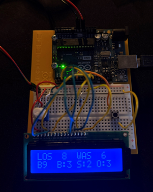

Wanted a small scoreboard for my desk showing the latest games as an attempt to reduce my screen time...

How it works:
1. MLB Stats API 
 - using the free statsapi.mlb.com to pull the scores in
 - free to use

2. Python script
 - Polls API every 30s 
 - Parses JSON
 - formats serial packet

3. Arduino UNO
 - Parses packet
 - Drives display
 - feel free to use anything, doesn't need to be the UNO just had one   laying around for this

Parts used:
- 1x Arduino UNO
- 13x Cables
- 1x Display (i used an 16×2 alphanumeric LCD) 
- 1x pushbuttons to cycle between live games (if you want multiple teams)
- 1x 10kΩ potentiometer for LCD contrast (required)
- 1x 220Ω resistor for the LCD backlight

Wiring:
To be updated once esp32 and other materials arrived but here is the initial concept

-  Wiring:
    LCD Pin 1  (VSS)  -> GND
   
    LCD Pin 2  (VDD)  -> 5V
   
    LCD Pin 3  (V0)   -> Potentiometer wiper (contrast)
   
    LCD Pin 4  (RS)   -> Arduino pin 12
   
    LCD Pin 5  (RW)   -> GND
   
    LCD Pin 6  (EN)   -> Arduino pin 11
   
    LCD Pin 11 (D4)   -> Arduino pin 5
   
    LCD Pin 12 (D5)   -> Arduino pin 4
   
    LCD Pin 13 (D6)   -> Arduino pin 3
   
    LCD Pin 14 (D7)   -> Arduino pin 2
   
    LCD Pin 15 (A)    -> 220 ohm resistor -> 5V  (backlight +)
    LCD Pin 16 (K)    -> GND                     (backlight -)

    Potentiometer:
      Left leg  -> GND
      Right leg -> 5V
      Wiper     -> LCD Pin 3

    Cycle button:
    One leg -> Arduino pin 7
    Other leg -> GND
    (uses internal pull-up, no resistor needed)

Case (not needed)
- Insert Case Description Here
- Feel free to use the same one or come up with your own
- Inert Case Image Here

Additional Notes:
- The script can be hardcoded to your favorite team if you dont have a button or dont care about other teams
- Will be creating a V2 of this using an esp32 as an attempt to make this pocket-sized
